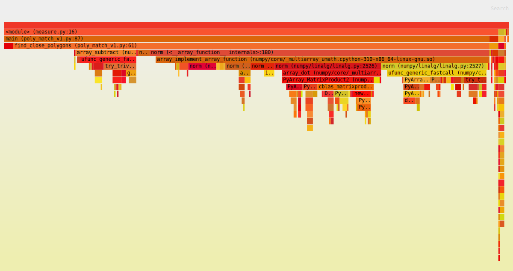
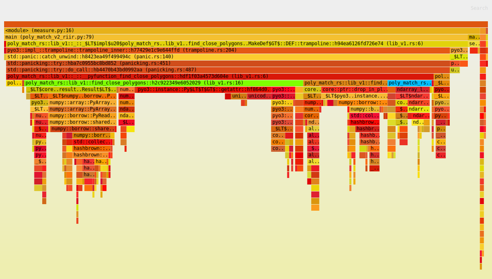

# Making Python 100x faster with less than 100 lines of Rust

A while ago at [$work](https://www.trigoretail.com/), we had a performance issue with one of our core Python libraries.

This particular library forms the backbone of our 3D processing pipeline. It’s a rather big and complex library which uses NumPy and other scientific Python packages to do a wide range of mathematical and geometrical operations.

Our system also has to work on-prem with limited CPU resources, and while at first it performed well,
as the number of concurrent physical users grew we started running into problems and our system struggled to keep up with the load.

We came to the conclusion that we had to make our system at least 50 times faster to handle the increased workload, and we figured that Rust could help us achieve that.

Because the performance problems we encountered are pretty common,
we can recreate & solve them right here, in a (not-so-short) article.

So grab a cup of tea (or coffee) and I'll walk you through (a) the basic underlying problem and (b) a few iterations of optimizations we can apply to solve this problem.

If you want to jump straight to the final code, just to go to [the summary](#summary).

## Our running example

Let’s create a small library, which will exhibit our original performance issues (but does completely arbitrary work).

Imagine you have a list of polygons and a of list points, all in 2D. 
For business reasons, we want to “match” each point to a single polygon.

Our imaginary library is going to:

1. Start with an initial list of points and polygons (all in 2D).
2. For each point, find a much smaller subset of polygons that are closest to it, based on distance from the center.
3. Out of those polygons, select the "best" one (we are going to use "smallest area" as "best").

In code, that's going to look like this (The full code can be found [here](https://github.com/ohadravid/poly-match)):

```python
from typing import List, Tuple
import numpy as np
from dataclasses import dataclass
from functools import cached_property

Point = np.array

@dataclass
class Polygon:
    x: np.array
    y: np.array

    @cached_property
    def center(self) -> Point: ...
    def area(self) -> float: ...

def find_close_polygons(polygon_subset: List[Polygon], point: Point, max_dist: float) -> List[Polygon]:
    ...

def select_best_polygon(polygon_sets: List[Tuple[Point, List[Polygon]]]) -> List[Tuple[Point, Polygon]]:
    ...

def main(polygons: List[Polygon], points: np.ndarray) -> List[Tuple[Point, Polygon]]:
    ...
```

**The key difficulty (performance wise) is this mix of Python objects and numpy arrays.**

We are going to analyze this in depth in a minute.

It's worth noting that converting parts of / everything to [vectorized](https://numpy.org/doc/stable/glossary.html#term-vectorization) numpy might be possible for this toy library, 
but will be nearly impossible for the real library while making the code much less readable and modifiable, and the gains are going to be limited ([here's a partially vertorized version](https://github.com/ohadravid/poly-match/blob/main/poly_match_v1_5_vectorized.py), which is faster but far from the results we are going to achieve).

Also, using any JIT-based tricks (PyPy / numba) results in very small gains (as we will measure, just to make sure).

## Why not just Rewrite It (all) In Rust™?

As compelling as a complete rewrite was, it had a few problems:

1. The library was already using numpy for a lot of its calculations, so why should we expect Rust to be better?
2. It is big and complex and very business critical and highly algorithmic, so that would take ~months of work, and our poor on-prem server is dying **today**.
3. A bunch of friendly researchers are actively working on said library, implementing better algorithms and doing a lot of experiments.
They aren't going to be very happy to learn a new programming language, waiting for things to compile and fighting with the borrow checker. They would appreciate us not moving their cheese too far.

## Dipping our toes

It is time to introduce our friend the profiler.

Python has a built in Profiler (`cProfile`), but in this case it's not really the right tool for the job:

1. It'll introduce a lot of overhead to all the Python code, and non for native code, so our results might be biased.
2. We won't be able to see into native frames, meaning we aren't going to be able to see into our Rust code.

We are going to use `py-spy` ([GitHub](https://github.com/benfred/py-spy)).

`py-spy` is a [sampling profiler](https://en.wikipedia.org/wiki/Profiling_(computer_programming)#Statistical_profilers) which can see into native frames.

They also mercifully publish pre-built wheels to pypi, so we can just `pip install py-spy` and get to work.

We also need something to measure.

```python
# measure.py
import time
import poly_match
import os
  
# Reduce noise, actually improve perf in our case.
os.environ["OPENBLAS_NUM_THREADS"] = "1"

polygons, points = poly_match.generate_example()

# We are going to increase this as the code gets faster and faster.
NUM_ITER = 10

t0 = time.perf_counter()
for _ in range(NUM_ITER):
    poly_match.main(polygons, points)
t1 = time.perf_counter()

took = (t1 - t0) / NUM_ITER
print(f"Took and avg of {took * 1000:.2f}ms per iteration")
```

It's not very scientific, but it's going to take us _very_ far.

> "Good benchmarking is hard. Having said that, do not stress too much about having a perfect benchmarking setup, particularly when you start optimizing a program."
>
> ~ Nicholas Nethercote, in ["The Rust Performance Book"](https://nnethercote.github.io/perf-book/benchmarking.html)


Running this script will give us our baseline:

```bash
$ python measure.py
Took an avg of 293.41ms per iteration
```

For the original library, we used 50 different examples to make sure all cases are covered.

This matched the overall system perf, meaning we can start working on crushing this number.

Side note: We can also measure using PyPy (we'll also add a warmup to allow the JIT to do its magic).

```bash
$ conda create -n pypyenv -c conda-forge pypy numpy && conda activate pypyenv
$ pypy measure_with_warmup.py
Took an avg of 1495.81ms per iteration
```

## Measure first

So, let's find out what is so slow here.

```bash
$ py-spy record --native -o profile.svg -- python measure.py
py-spy> Sampling process 100 times a second. Press Control-C to exit.

Took an avg of 365.43ms per iteration

py-spy> Stopped sampling because process exited
py-spy> Wrote flamegraph data to 'profile.svg'. Samples: 391 Errors: 0
```

Already, we can see that the overhead is pretty small.
Just for comparison, using `cProfile` we get this:

```bash
$ python -m cProfile measure.py
Took an avg of 546.47ms per iteration
         7551778 function calls (7409483 primitive calls) in 7.806 seconds
         ...
```

We get this nice, reddish graph called a [flamegraph](https://www.brendangregg.com/FlameGraphs/cpuflamegraphs.html):



Each box is a function, and we can see the relative time we spend in each function,
including the functions it is calling to (going down the graph/stack).
Try clicking on a the `norm` box to zoom into it.

Here, the main takeaways are:

1. The vast majority of time is spent in `find_close_polygons`.
2. Most of that time is spend doing `norm`, which is a numpy function.

So, let's have a look at `find_close_polygons`:

```python
def find_close_polygons(
    polygon_subset: List[Polygon], point: np.array, max_dist: float
) -> List[Polygon]:
    close_polygons = []
    for poly in polygon_subset:
        if np.linalg.norm(poly.center - point) < max_dist:
            close_polygons.append(poly)

    return close_polygons
```

We are going to rewrite this function in Rust.

Before diving into the details, it's important to notice a few things here:

1. This function accepts & returns complex objects (`Polygon`, `np.array`).
2. The size of the objects is non-trivial (so copying stuff might cost us).
3. This function is called "a lot" (so overhead we introduce is probably going to matter).


## My first Rust module

`pyo3` is a crate for interacting between Python and Rust.
It has exceptionally good documentation, and they explain the basic setup [here](https://pyo3.rs/v0.18.1/#using-rust-from-python).

We are going to call our crate `poly_match_rs`, and add function called `find_close_polygons`.

```bash
mkdir poly_match_rs && cd "$_"
pip install maturin
maturin init --bindings pyo3
maturin develop
```

Starting out, our crate is going to look like this:

```rust
use pyo3::prelude::*;

#[pyfunction]
fn find_close_polygons() -> PyResult<()> {
    Ok(())
}

#[pymodule]
fn poly_match_rs(_py: Python, m: &PyModule) -> PyResult<()> {
    m.add_function(wrap_pyfunction!(find_close_polygons, m)?)?;
    Ok(())
}
```

We also need to remember to execute `maturin develop` every time we change the Rust library.

And thats it! Let's call our new function and see what happens.

```python
>>> poly_match_rs.find_close_polygons(polygons, point, max_dist)
E TypeError: poly_match_rs.poly_match_rs.find_close_polygons() takes no arguments (3 given)
```

## v1 - A naive Rust translation

We'll start with matching the expected API.

PyO3 is pretty smart about Python to Rust conversions, so that's going to be pretty easy:

```rust
#[pyfunction]
fn find_close_polygons(polygons: Vec<PyObject>, point: PyObject, max_dist: f64) -> PyResult<Vec<PyObject>> {
    Ok(vec![])
}
```

`PyObject` is (as the name suggest) a generic "anything goes" Python object.
We'll try to interact with it in a bit.

This should make the program run (albite incorrectly).

I'm going to just copy and paste the original Python function, and fix the syntax.

```rust
#[pyfunction]
fn find_close_polygons(polygons: Vec<PyObject>, point: PyObject, max_dist: f64) -> PyResult<Vec<PyObject>> {
    let mut close_polygons = vec![];
    
    for poly in polygons {
        if norm(poly.center - point) < max_dist {
            close_polygons.push(poly)
        }
    }
    
    Ok(close_polygons)
}
```

Cool, but this won't compile:

```bash
% maturin develop
...

error[E0609]: no field `center` on type `Py<PyAny>`
 --> src/lib.rs:8:22
  |
8 |         if norm(poly.center - point) < max_dist {
  |                      ^^^^^^ unknown field


error[E0425]: cannot find function `norm` in this scope
 --> src/lib.rs:8:12
  |
8 |         if norm(poly.center - point) < max_dist {
  |            ^^^^ not found in this scope


error: aborting due to 2 previous errors ] 58/59: poly_match_rs
```


We need three crates to implement our function:

```toml
# For Rust-native array operations.
ndarray = "0.15"

# For a `norm` function for arrays.
ndarray-linalg = "0.16"  

# For accessing numpy-created objects, based on `ndarray`.
numpy = "0.18"
```

First, lets turn the opaque and generic `point: PyObject` into something we can work with.

Just like we asked PyO3 for a "`Vec` of `PyObject`s", we can ask for a numpy-array,
and it'll auto-convert the argument for us.

```rust
use numpy::PyReadonlyArray1;

#[pyfunction]
fn find_close_polygons(
    // An object which says "I have the GIL", so we can access Python-managed memory.
    py: Python<'_>,
    polygons: Vec<PyObject>,
    // A reference to a numpy array we will be able to access.
    point: PyReadonlyArray1<f64>,
    max_dist: f64,
) -> PyResult<Vec<PyObject>> {
    // Convert to `ndarray::ArrayView1`, a fully operational native array.
    let point = point.as_array();
    ...
}
```

Because `point` is now an `ArrayView1`, we can actually use it. For example:

```rust
// Make the `norm` function available.
use ndarray_linalg::Norm;

assert_eq!((point.to_owned() - point).norm(), 0.);
```

Now we just need to get the center of each polygon, and "cast" it to an `ArrayView1`.

In PyO3, this looks like this:

```rust
let center = poly
  .getattr(py, "center")?                 // Python-style getattr, requires a GIL token (`py`).
  .extract::<PyReadonlyArray1<f64>>(py)?  // Tell PyO3 what to convert the result to.
  .as_array()                             // Like `point` before.
  .to_owned();                            // We need one of the sides of the `-` to be "owned".
```

It's a bit of a mouthful, but overall the result is a pretty clear line-to-line translation of the original code:

```rust {linenos=inline}
use pyo3::prelude::*;

use ndarray_linalg::Norm;
use numpy::PyReadonlyArray1;

#[pyfunction]
fn find_close_polygons(
    py: Python<'_>,
    polygons: Vec<PyObject>,
    point: PyReadonlyArray1<f64>,
    max_dist: f64,
) -> PyResult<Vec<PyObject>> {
    let mut close_polygons = vec![];
    let point = point.as_array();
    for poly in polygons {
        let center = poly
            .getattr(py, "center")?
            .extract::<PyReadonlyArray1<f64>>(py)?
            .as_array()
            .to_owned();

        if (center - point).norm() < max_dist {
            close_polygons.push(poly)
        }
    }

    Ok(close_polygons)
}
```

vs the original:

```python
def find_close_polygons(
    polygon_subset: List[Polygon], point: np.array, max_dist: float
) -> List[Polygon]:
    close_polygons = []
    for poly in polygon_subset:
        if np.linalg.norm(poly.center - point) < max_dist:
            close_polygons.append(poly)

    return close_polygons
```

We expect this version to have some advantage over the original function,
but how much?

```bash
$ (cd ./poly_match_rs/ && maturin develop)
$ python measure.py
Took an avg of 609.46ms per iteration 
```

So.. Is Rust just super slow?
No! We just forgot to ask for speed! 
If we run with `maturin develop --release` we get much better results:

```bash
$ (cd ./poly_match_rs/ && maturin develop --release)
$ python measure.py
Took an avg of 23.44ms per iteration
```

Now _that_ is a nice speedup!

We also want to see into our native code, so we are going to enable debug symbols in release.
While we are at it, we might as well ask for _maximum speed_.

```toml
# added to Cargo.toml
[profile.release]
debug = true       # Debug symbols for our profiler.
lto = true         # Link-time optimization.
codegen-units = 1  # Slower compilation but faster code. 
```

## v2 - Rewrite even more in Rust

Now, using the `--native` flag in `py-spy` is going to show us both Python and our new native code.

Running `py-spy` again

```bash
$ py-spy record --native -o profile.svg -- python measure.py
py-spy> Sampling process 100 times a second. Press Control-C to exit.
```

we get this flamegraph (non-red colors are added to so we can refer to them):



Looking at the profiler output, we can see a few interesting things:

1. The relative size of `find_close_polygons::...::trampoline` (the symbol Python directly calls) and `__pyfunction_find_close_polygons` (our actual implementation).
    - Hovering, they are 95% vs 88% of samples, so the overhead is pretty small.
2. The actual logic (`if (center - point).norm() < max_dist { ... }`) which is <code style="background-color: deepskyblue !important;">lib_v1.rs:22</code> (very small box on the right), is about 9% of the total runtime.
    - So 10x improvement should still be possible!
3. Most of the time is spent in <code style="background-color: chartreuse !important;">lib_v1.rs:16</code>, which is `poly.getattr(...).extract(...)` and if we zoom in we can see is really just `getattr` and getting the underlying array using `as_array`.

The conclusion here is that we need to focus on solving the 3rd point,
and the way to do that is to Rewrite `Polygon` in Rust.

Let's look at our target:

```python
@dataclass
class Polygon:
    x: np.array
    y: np.array
    _area: float = None

    @cached_property
    def center(self) -> np.array:
        centroid = np.array([self.x, self.y]).mean(axis=1)
        return centroid

    def area(self) -> float:
        if self._area is None:
            self._area = 0.5 * np.abs(
                np.dot(self.x, np.roll(self.y, 1)) - np.dot(self.y, np.roll(self.x, 1))
            )
        return self._area
```

We'll want to keep the existing API as much as possible,
but we don't really need `area` to be that fast (for now).

The actual class might have additional complex stuff, 
like a `merge` method which uses `ConvexHull` from `scipy.spatial`.

To cut costs (and limit the scope of this already long article),
we will only move the "core" functionality of `Polygon` to Rust, 
and subclass that from Python to implement the rest of the API.

Our `struct` is going to look like this:

```rust
// `Array1` is a 1d array, and the `numpy` crate will play nicely with it.
use ndarray::Array1;

// `subclass` tells PyO3 to allow subclassing this in Python.
#[pyclass(subclass)]
struct Polygon {
    x: Array1<f64>,
    y: Array1<f64>,
    center: Array1<f64>,
}
```

Now we need to actually implement it.
We want to expose `poly.{x, y, center}` as:
1. Properties.
2. numpy Arrays.

We also need a constructor so Python can create new `Polygon`s.

```rust
use numpy::{PyArray1, PyReadonlyArray1, ToPyArray};

#[pymethods]
impl Polygon {
    #[new]
    fn new(x: PyReadonlyArray1<f64>, y: PyReadonlyArray1<f64>) -> Polygon {
        let x = x.as_array();
        let y = y.as_array();
        let center = Array1::from_vec(vec![x.mean().unwrap(), y.mean().unwrap()]);

        Polygon {
            x: x.to_owned(),
            y: y.to_owned(),
            center,
        }
    }
    
    // the `Py<..>` in the return type is a way of saying "an Object owned by Python".
    #[getter]               
    fn x(&self, py: Python<'_>) -> PyResult<Py<PyArray1<f64>>> {
        Ok(self.x.to_pyarray(py).to_owned()) // Create a Python-owned, numpy version of `x`.
    }

    // Same for `y` and `center`.
}
```


We need to add our new struct as a class to the module:

```rust
#[pymodule]
fn poly_match_rs(_py: Python, m: &PyModule) -> PyResult<()> {
    m.add_class::<Polygon>()?; // new.
    m.add_function(wrap_pyfunction!(find_close_polygons, m)?)?;
    Ok(())
}
```

And now we can update the Python code to use it:

```python
class Polygon(poly_match_rs.Polygon):
    _area: float = None

    def area(self) -> float:
        ...
```

We can compile it and it'll actually work, but it'll be much slower!
(Remember that `x`, `y`, and `center` will now need to create a new numpy array **on each access**).

To actually improve performance, we need to `extract` our original Rust-based `Polygon` from the list of Python-`Polygon`s.

PyO3 is very flexible with this type of operation, so there are a few ways we could do it.
One limit we have is that we also need to return Python-`Polygon`s, and we don't want to do any cloning of the actual data.

It's possible to manually call `.extract::<Polygon>(py)?` on each `PyObject`s, but we ask PyO3 to give us `Py<Polygon>` directly.

This is a reference to a Python-owned object,
which we expect to contain an instance (or a subclass, in our case) of a native `pyclass` struct.

```rust {linenos=inline,linenostart=45}
#[pyfunction]
fn find_close_polygons(
    py: Python<'_>,
    polygons: Vec<Py<Polygon>>,             // References to Python-owned objects.
    point: PyReadonlyArray1<f64>,
    max_dist: f64,
) -> PyResult<Vec<Py<Polygon>>> {           // Return the same `Py` references, unmodified.
    let mut close_polygons = vec![];
    let point = point.as_array();
    for poly in polygons {
        let center = poly.borrow(py).center // Need to use the GIL (`py`) to borrow the underlying `Polygon`.
            .to_owned();

        if (center - point).norm() < max_dist {
            close_polygons.push(poly)
        }
    }

    Ok(close_polygons)
}
```

Let's see what we get using this code:

```bash
$ python measure.py
Took an avg of 6.29ms per iteration
```

We are nearly there! Just x2 to go!

## v3 - Avoid allocations

Let's fire up the profiler one more time.


1. We start to see `select_best_polygon`, which now calls some Rust code (when it gets the `x` & `y` vectors)
    - We could fix that, but that's a very small potential improvement (maybe 10%)
2. We see we spend about 20% the time on `extract_argument` (under <code style="background-color: orchid !important;">lib_v2.rs:48</code>), so we are still paying quite a lot on overhead!
    - But most of the time is in `PyIterator::next` and `PyTypeInfo::is_type_of`, which aren't easy to fix.
3. We see a bunch of time spent allocating stuff!
    - <code style="background-color: cornflowerblue !important;">lib_v2.rs:58</code> is our `if`, and we see `drop_in_place` and `to_owned`.
    - The actual line is about 35% of the overall time, which is a lot more than we expect: this should be the "fast bit" with all the data in place.

Let's tackle the last point.

This our problematic snippet:

```rust
let center = poly.borrow(py).center
    .to_owned();

if (center - point).norm() < max_dist { ... } 
```

What we want is to avoid that `to_owned`.
But we need an owned object for `norm`, so we'll have to implement that manually.

(The reason we can improve on `ndarray` here is that we know that our array is actually just 2 `f32`s).

This would look like this:

```rust
use ndarray_linalg::Scalar;

let center = &poly.as_ref(py).borrow().center;

if ((center[0] - point[0]).square() + (center[1] - point[1]).square()).sqrt() < max_dist {
    close_polygons.push(poly)
}
```

But, alas, the borrow checker is unhappy with us:

```rust
error[E0505]: cannot move out of `poly` because it is borrowed
  --> src/lib.rs:58:33
   |
55 |         let center = &poly.as_ref(py).borrow().center;
   |                       ------------------------
   |                       |
   |                       borrow of `poly` occurs here
   |                       a temporary with access to the borrow is created here ...
...
58 |             close_polygons.push(poly);
   |                                 ^^^^ move out of `poly` occurs here
59 |         }
60 |     }
   |     - ... and the borrow might be used here, when that temporary is dropped and runs the `Drop` code for type `PyRef`
```

As usual, the borrow checker is correct: we are doing memory crimes.

The simpler fix is to _Just Clone_, and `close_polygons.push(poly.clone())` compiles. 

This is actually a very cheap clone, because we only `incr` the reference count of the Python object.

However, in this case we can also shorten the borrow by doing a classic Rust trick:

```rust
let norm = {
    let center = &poly.as_ref(py).borrow().center;

    ((center[0] - point[0]).square() + (center[1] - point[1]).square()).sqrt()
};

if norm < max_dist {
    close_polygons.push(poly)
}
```

Because `poly` is only borrowed in the inner scope, once we reach `close_polygons.push` the compiler
can know that we no longer hold that reference, and will happily compile the new version.

And finally, we have

```bash
$ python measure.py
Took an avg of 2.90ms per iteration
```

Which is 100x improvement over the original code.


## Summary

We started out with this Python code:

```python
@dataclass
class Polygon:
    x: np.array
    y: np.array
    _area: float = None

    @cached_property
    def center(self) -> np.array:
        centroid = np.array([self.x, self.y]).mean(axis=1)
        return centroid

    def area(self) -> float:
        ...

def find_close_polygons(
    polygon_subset: List[Polygon], point: np.array, max_dist: float
) -> List[Polygon]:
    close_polygons = []
    for poly in polygon_subset:
        if np.linalg.norm(poly.center - point) < max_dist:
            close_polygons.append(poly)

    return close_polygons

# Rest of file (main, select_best_polygon).
```

We profiled it using `py-spy`, and even our most [naive, line-to-line translation](#v1-a-naive-rust-translation) of `find_close_polygons` resulted in more than a x10 improvement.

We did a few additional iterations of profile-write-measure iterations until we finally we gained a x100 improvement in runtime, while keeping the same API as the original library.

| Version                                                      | Avg time per iteration (ms)  | Multiplier | 
|--------------------------------------------------------------|------------------------------|------------|
| Baseline implementation (Python)                             | 293.41                       | 1x         |
| Naive line-to-line Rust translation of `find_close_polygons` | 23.44                        | 12.50x     |
| `Polygon` implementation in Rust                             | 6.29                         | 46.53x     |
| Optimized allocation implementation in Rust                  | 2.90                         | 101.16x    |

The final python code looks like this

```python
import poly_match_rs
from poly_match_rs import find_close_polygons

class Polygon(poly_match_rs.Polygon):
    _area: float = None

    def area(self) -> float:
        ...

# Rest of file unchanged (main, select_best_polygon).
```

which calls this Rust code:

```rust
use pyo3::prelude::*;

use ndarray::Array1;
use ndarray_linalg::Scalar;
use numpy::{PyArray1, PyReadonlyArray1, ToPyArray};

#[pyclass(subclass)]
struct Polygon {
    x: Array1<f64>,
    y: Array1<f64>,
    center: Array1<f64>,
}

#[pymethods]
impl Polygon {
    #[new]
    fn new(x: PyReadonlyArray1<f64>, y: PyReadonlyArray1<f64>) -> Polygon {
        let x = x.as_array();
        let y = y.as_array();
        let center = Array1::from_vec(vec![x.mean().unwrap(), y.mean().unwrap()]);

        Polygon {
            x: x.to_owned(),
            y: y.to_owned(),
            center,
        }
    }

    #[getter]
    fn x(&self, py: Python<'_>) -> PyResult<Py<PyArray1<f64>>> {
        Ok(self.x.to_pyarray(py).to_owned())
    }

    // Same for `y` and `center`.
}

#[pyfunction]
fn find_close_polygons(
    py: Python<'_>,
    polygons: Vec<Py<Polygon>>,
    point: PyReadonlyArray1<f64>,
    max_dist: f64,
) -> PyResult<Vec<Py<Polygon>>> {
    let mut close_polygons = vec![];
    let point = point.as_array();
    for poly in polygons {
        let norm = {
            let center = &poly.as_ref(py).borrow().center;

            ((center[0] - point[0]).square() + (center[1] - point[1]).square()).sqrt()
        };

        if norm < max_dist {
            close_polygons.push(poly)
        }
    }

    Ok(close_polygons)
}

#[pymodule]
fn poly_match_rs(_py: Python, m: &PyModule) -> PyResult<()> {
    m.add_class::<Polygon>()?;
    m.add_function(wrap_pyfunction!(find_close_polygons, m)?)?;
    Ok(())
}
```

## Takeaways 

- Rust (with the help of pyo3) unlocks true native performance for everyday Python code, with minimal compromises.

- Python is a superb API for researchers, and crafting fast building blocks with Rust is an extremely powerful combination.

- Profiling is super interesting, and it pushes you to truly understand everything that’s happening in your code.

And finally: computers are _crazy fast_. The next time you wait for something to complete, consider firing up a profiler, you might learn something new 🚀
